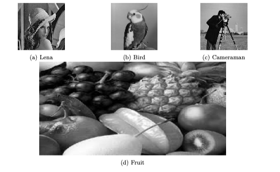

作为习惯了 cui 的程序员, 一直在逃避插图这类任务, 但是一图胜千言, 尤其是现在的论文写作, 插图至关重要, 今天就做个了结.


## 插入单张图片

```tex
\documentclass{article}
\usepackage{graphicx}

\begin{document}
	This is a tutorial to show how to insert images through tex. 
	
	I dream to do this in the future. So cool. I want to show it to my dream girl. Hahahahaha! I dream to do this in the future. So cool. I want to show it to my dream girl. Hahahahaha!I dream to do this in the future. So cool. I want to show it to my dream girl. Hahahahaha!I dream to do this in the future. So cool. I want to show it to my dream girl. Hahahahaha!I dream to do this in the future. So cool. I want to show it to my dream girl. Hahahahaha!I dream to do this in the future. So cool. I want to show it to my dream girl. Hahahahaha!
	
	\includegraphics{human_flag.png}
	
	This is a tutorial to show how to insert images through tex. 
\end{document}
```

插图其实只用到了一个命令, `\includegraphics{human_flag.png}`, 但是这个简单的语句有很多问题, 比如无法进行 `label` 和 `ref` , 而且也不方便控制图片位置. 下面进行改进, 将 `\includegraphics{human_flag.png}` 换为如下:

```
\begin{figure}
	\includegraphics[width = \linewidth]{human_flag.png}
	\caption{human_flag}
	\label{fig:human_flag}
\end{figure}
```

注意到, latex 有时会根据图片周围的文本环境, 对图片的位置进行调整, 也就是浮动体. 如果你不想让 latex 这样做, 你可以使用相关选项.

```
\begin{figure}[htbp] % 需要 \usepackage{float}
	\includegraphics[width = \linewidth]{human_flag.png}
	\caption{human_flag}
	\label{fig:human_flag}
\end{figure}
```

`[htbp]` 中的 h, t, b, p 分别代表 here, top, bottom, page, latex 会按照 h, t, b, p 的顺序尽可能放置, 不过这与你给定的选项顺序无关, 如果你指定 `[hb]` , 那就会优先 h, 再考虑 t.

## 插入多张图片

有时在一个 figure 中需要多张图片, 就是所谓的 subfigure, 需要 `\usepackage{subcaption}`

```
 \begin{figure}[h!]
	\centering
	\begin{subfigure}[b]{0.2\linewidth}
		\includegraphics[width=\linewidth]{images/lena.jpg}
		\caption{Lena}
	\end{subfigure} 
	\hfill
	\begin{subfigure}[b]{0.2\linewidth}
		\includegraphics[width=\linewidth]{images/bird.jpg}
		\caption{Bird}
	\end{subfigure}
	\hfill
	\begin{subfigure}[b]{0.2\linewidth}
		\includegraphics[width=\linewidth]{images/cameraman.jpg}
		\caption{Cameraman}
	\end{subfigure} 
	
	\begin{subfigure}[b]{0.8\linewidth}
		\includegraphics[width=\linewidth,height=0.5\linewidth]{images/fruit.jpeg}
		\caption{Fruit}
	\end{subfigure} 
\end{figure}
```

效果如下



通过上面这个例子, 可以看出 `linewidth` 是相对于所在的具体的环境.

关于 subcaption 宏包, 注意两点:

- 不能与 subfigure 宏包同时使用
- 有时报兼容性的错, 可以这样使用

```tex 
\usepackage{subcaption}
\captionsetup{compatibility=false}
```